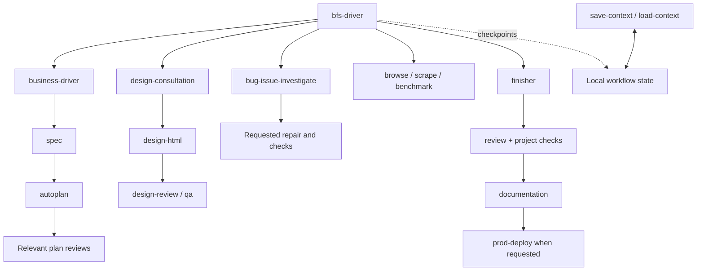

# BontaFlowStack

**28 connected skills for turning business ideas into designed, tested and delivered products.**

BontaFlowStack works inside **Codex Desktop on Windows x64**. Describe your goal
in your own language. The plugin helps choose the next step, performs the requested
work, checks the result and keeps local progress for continuation.

It supports business and product planning, brand and interface direction, website
development, debugging, testing, documentation and delivery. Each skill also works
on its own when you already have its input.

## Install

You need Codex Desktop and **Node.js 24 or newer**. The core uses no npm packages.

With the Codex CLI available in PowerShell:

```powershell
codex plugin marketplace add BillBalint-SM/bontaflowstack-workbook --ref main
codex plugin add bontaflowstack@bontaflowstack
```

Start a new Codex chat in your project and ask:

```text
$bfs-driver Set up BontaFlowStack for this project, including browser and design capabilities.
```

Review and trust the plugin's **PreToolUse** and **Stop** hooks through Codex's
`/hooks` interface. New or changed hook definitions need user trust before Codex
runs them. This enables task protection and interruption tracking; ordinary
workflow checkpoints are written by the core. [Hook setup](https://learn.chatgpt.com/docs/hooks#review-and-trust-hooks)

The setup skill checks the installation. Browser, render and design operations use
the separately installed [BontaFlowStack engines](https://github.com/BillBalint-SM/bontaflowstack-engines).
Their installer checks the pinned source archive, installs its locked dependencies
and Chromium, then registers the checked Node.js tools. Bun is not required.

For a downloaded source ZIP or a clone, run from the repository directory:

```powershell
powershell -NoProfile -ExecutionPolicy Bypass -File .\scripts\setup.ps1 -InstallPlugin -WithEngines
```

Add `-InstallPrerequisites` to install missing Node.js through Windows Package
Manager. Omit `-WithEngines` for planning, source review, documentation and local
memory only. Git is needed for Git workflows and installing a Git marketplace;
Git Bash and jq are not required by the core.

[Installation and troubleshooting](docs/bontaflowstack/INSTALL-WINDOWS.md)

## Start with a goal

| You want to… | Example request |
|---|---|
| Develop an idea | `$business-driver Help me shape an offer for independent consultants.` |
| Turn a brief into a plan | `$bfs-driver Turn this brief into a specification and check the implementation plan.` |
| Compare visual directions | `$design-consultation Explore three directions using this brief and content.` |
| Build an approved page | `$design-html Implement the selected direction in this project and check the rendered page.` |
| Inspect a user journey | `$qa Inspect checkout at this URL and report reproducible issues.` |
| Diagnose and fix a bug | `$bug-issue-investigate Reproduce this failure, repair its cause and verify the fix.` |
| Finish a change | `$finisher Review, test and document this change, then prepare it for delivery.` |
| Resume later | `$load-context Find the latest saved workflow and show what remains.` |

Use `$bfs-driver` when you want help choosing a route. Naming a skill goes directly
to that skill. Ask explicitly for publication or deployment when you want those
operations included.

## How workflows connect



The driver loads and follows each relevant skill in the same chat. A completed
step passes its checked artifacts and settled decisions to the next step.
Missing information pauses only the dependent work. You can supply a document,
existing file or your own description instead of running an earlier skill.

There are three kinds of connection:

- **Results:** a business brief becomes input to a specification or design.
- **Capabilities:** QA, scraping, rendering and benchmarks share the browser engine.
- **Project data:** skills reuse the same design decisions, memory and workflow state.

After every recorded step, the core writes and reads back a local checkpoint.
The Stop hook marks an unfinished active step interrupted. It never turns an
interruption into a successful result. Changed input files make old checks stale.
`save-context` adds a manual snapshot; `load-context` checks what changed before
continuing. Remembered decisions do not grant permission for new external actions.

## The 28 skills

| Area | Skills | What they do |
|---|---|---|
| Routing | `bfs-driver` | Choose and run a skill or workflow; set up capabilities. |
| Business and specification | `business-driver`, `spec` | Clarify the customer problem, value and scope; write verifiable requirements. |
| Plan coordination | `autoplan`, `plan-tune` | Select relevant reviews; manage explicit preferences and local proposals. |
| Plan reviews | `plan-ceo-review`, `plan-eng-review`, `plan-design-review`, `plan-devex-review` | Check business value, engineering, UI/UX and planned developer-facing interfaces. |
| Design | `design-consultation`, `design-html`, `design-review` | Compare directions, preserve your selection, implement and inspect the rendered result. |
| Browser and data | `browse`, `scrape`, `benchmark` | Browse or sign in visibly, extract verified data, measure page performance. |
| Quality | `bug-issue-investigate`, `review`, `cso-audit`, `health`, `qa` | Diagnose defects, inspect changes and security, run project checks and test web flows. |
| Documentation and delivery | `documentation`, `finisher`, `prod-deploy`, `landing-report` | Maintain docs, prepare changes, use existing deployment configuration and report live delivery state. |
| Continuation and control | `bontaflow-memory`, `save-context`, `load-context`, `guard` | Keep project decisions and learnings, save/restore progress and apply optional task protections. |

### Combined modes

- **design-consultation:** consultation, variants, Codex image generation and refinement.
- **browse:** page work, visible browser, manual login and continuation in the same session.
- **qa:** inspection and reporting by default; requested repair followed by retesting.
- **documentation:** one coverage assessment identifies both missing and outdated documentation.
- **bontaflow-memory:** typed decisions and learnings, search, revisions, exact-record pruning and export.
- **guard:** command warnings and an edit boundary can be enabled independently.
  Releasing the boundary keeps command warnings active.

The full mode and handoff definitions live in the [catalog](plugins/bontaflowstack/catalog.json).
Older names resolve through the driver; only the final 28 entries are installed.
Saved reusable browser automation, standalone developer-experience audits,
deployment provisioning and retrospective reports are outside this version.

## Local data and optional tools

Core data stays in `%LOCALAPPDATA%\BontaFlowStack\state\v2`. Project memory is
shared across linked Git worktrees; workflow, task, browser and guard state are
separate. Non-Git project directories also work. Nothing automatically uploads
memory or installs a browser engine. Existing older data is preserved; selected
notes can be imported explicitly.

Guard requires working native hooks and reports its supported coverage: edit and
patch paths, plus recognized destructive shell commands. It is optional and is
not an operating-system sandbox. Arbitrary shell writes are outside its edit-boundary
coverage.

Image generation and editing use **Codex's image generation tool**, when available
in the current chat. BontaFlowStack does not request a separate image API key.
The local design tool creates comparison boards and records your chosen direction.

Optional prerequisites for specific design operations:

- [impeccable](https://github.com/pbakaus/impeccable): additional automated design checks.
- [Google DESIGN.md](https://github.com/google-labs-code/design.md): checking and exporting that specific design-document format. It can be used without Stitch; there is no built-in Stitch connection.

Neither is required for ordinary BontaFlowStack design work. Their source is not
included in either BontaFlowStack source package. The engine README explains how
to connect an installation. Browser profiles stay under
`~/.bontaflowstack/browser-profiles`, isolated by the task's session identity, so
Chromium also works with deeply nested Windows project paths.

## Develop and verify

```powershell
node scripts/check.mjs
node tests/engine.integration.mjs C:\path\to\bontaflowstack-engines
powershell -NoProfile -File scripts/build-package.ps1
```

The first command checks the 28-skill package and core behavior. The second uses
real Chromium for navigation, interactions, extraction, performance, screenshots,
HTML rendering and design comparison. The package builder writes a ZIP, SHA-256
and a per-file manifest; it records whether the source checkout was clean.

[Core command reference](plugins/bontaflowstack/references/commands.md) ·
[Execution contract](plugins/bontaflowstack/HOST.md)

## License

[MIT](LICENSE) — Copyright © 2026 Bálint Bilisics (BontaFlow).

This repository contains the BontaFlowStack core, skills and documentation.
Optional engines and separately installed applications are distributed separately.
